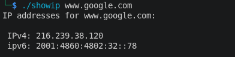

# C Fundamentals

A collection of small C programs written while learning systems-level C programming — networking, memory, pointers, and other fundamentals. Each program is self-contained and focused on a specific concept.

## Programs

### [`showip`](./showip)
Resolves a hostname to its IPv4/IPv6 address(es) using `getaddrinfo()`.

**Usage:**
```bash
./showip example.com
```
\

---

*More programs added as I go.*

## Requirements

- POSIX-compliant system (Linux/macOS/BSD)
- GCC or any standard C compiler

## License

MIT
